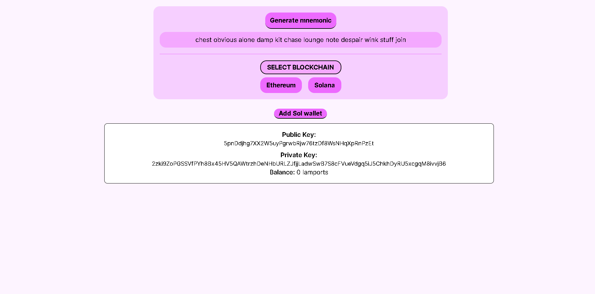

# 🔐 Web-Based Wallet (React + JSON-RPC)

A simple Web3 wallet built with React that lets you:

- 🔁 Generate random mnemonics
- 🌐 Choose between Ethereum and Solana chains
- 🧠 Derive deterministic keypairs (public/private) from the mnemonic
- 🛰️ Use raw JSON-RPC calls to communicate with the blockchain (QuickNode)

> ⚠️ For learning purposes only. Do not use this with real funds.

---

## ✨ Features

- React-based frontend
- Chain selection: Ethereum or Solana
- Generates keypairs using the provided mnemonic
- JSON-RPC calls to fetch balances (Solana for now)
- Uses `bip39`, `ed25519-hd-key`, and native crypto libs
- Clean interface (UI can be improved with state management libraries later)

---

## 🧠 Learning Highlights

- How mnemonics map to private/public keypairs
- Understanding JSON-RPC calls to blockchain nodes
- Building UI state from scratch without libraries (for now)
- Wallet logic: no extensions, no Metamask — everything in the browser

---

## 🛠️ Stack

- **Frontend**: React + Tailwind CSS (optional)
- **Blockchain**: JSON-RPC (manual fetch via QuickNode)
- **Solana Tools**: `@solana/web3.js`, `ed25519-hd-key`
- **Ethereum Tools**: `ethers.js`, `bip39`

---

## 🚀 Getting Started

### 1. Clone the Repo

```bash
git clone https://github.com/your-username/web-wallet
cd web-wallet

npm instal

npm run dev
```

App runs at: http://localhost:5173

---

## Screenshot
- 

## 🔮 Possible Next Steps
- Add UI polish and better UX with a state management library (Redux/Zustand)

- Add Ethereum balance fetching

- Enable smart contract interactions

- Add QR code export for addresses

- Local storage or session memory (optional)

- Deploy to Vercel or Netlify for demo

---

## 📚 References & Resources
- QuickNode Docs

- Alchemy Web3 Docs

- Solana Web3.js

- Ethers.js Docs

- BIP39 Mnemonic Standard

---

## 🤝 Contributing
This is a solo learning project, but feel free to fork it or open issues/PRs if you want to experiment or suggest improvements.

---
## 📬 Feedback Welcome!
Got ideas, feedback, or feature suggestions?
Open an issue or reach out — I’m always learning and building in public 🚀

---

## ⚠️ Disclaimer
This is not a production wallet.
There is no encryption, backend security, or private key protection.
Do NOT use this with real funds or mainnet networks.

---
## 📄 License
This project is open source under the MIT License.